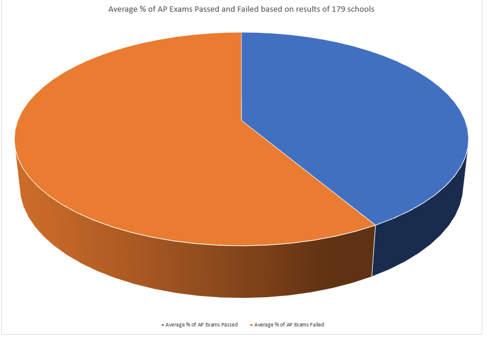

# Spreadsheet Analysis
## Introduction to the dataset
I found my dataset "2012 AP Results" on the website with open and free access to different datasets. The website is [NYCOpenData](https://opendata.cityofnewyork.us/) and the dataset I chose is [2012 AP Results](https://data.cityofnewyork.us/Education/2012-AP-Results/9ct9-prf9). The original format of the dataset was csv and it looked like this:

DBN | SCHOOL NAME | Num of AP Test Takers | Num of AP Total Exams Taken | Num of AP Exams Passed
------------ | ------------- | ------------- | ------------- | -------------
01M292 | HENRY STREET SCHOOL FOR INTERNATIONAL STUDIES | s | s | s
01M448 | UNIVERSITY NEIGHBORHOOD HIGH SCHOOL| 37 | 53 | 21
01M450 | EAST SIDE COMMUNITY SCHOOL | 12 | 12 | s
01M458 | FORSYTH SATELLITE ACADEMY | s | s | s
01M509 | MARTA VALLE HIGH SCHOOL | 14 | 15 | s
01M515 | LOWER EAST SIDE PREPARATORY HIGH SCHOOL | 50 | 60 | 54
01M539 | "NEW EXPLORATIONS INTO SCIENCE, TECHNOLOGY AND MATH HIGH SCHOOL" | 306 | 587 | 323
01M650 | CASCADES HIGH SCHOOL | s | s | s
01M696 | BARD HIGH SCHOOL EARLY COLLEGE | s | s | s
02M047 | 47 THE AMERICAN SIGN LANGUAGE AND ENGLISH SECONDARY SCHOOL | s | s | s
02M288 | FOOD AND FINANCE HIGH SCHOOL | 41 | 41 | s
02M294 | ESSEX STREET ACADEMY | s | s | s
02M296 | HIGH SCHOOL OF HOSPITALITY MANAGEMENT | s | s | s
02M298 | PACE HIGH SCHOOL | s | s | s
02M300 | "URBAN ASSEMBLY SCHOOL OF DESIGN AND CONSTRUCTION, THE" | 135 | 135 | 8
02M303 | "FACING HISTORY SCHOOL, THE" | 32 | 32 | s
02M305 | "URBAN ASSEMBLY ACADEMY OF GOVERNMENT AND LAW, THE" | 31 | 40 | 20
02M308 | LOWER MANHATTAN ARTS ACADEMY | 11 | 11 | s
02M313 | "JAMES BALDWIN SCHOOL, THE: A SCHOOL FOR EXPEDITIONARY LEARNING" | s | s | s

## Problems with dataset and coding part
In my dataset the only problem were "s" values which are missing values in dataset. Since the statistics was missing and none of the calculations cannot be made because of the missing values I marked them as "useless", that's why I wrote a code which deletes the whole row with that "s" if it finds it in the line:
```python
if s[-3] == "s" or s[-3] == "s" or s[-1] == "s\n":
    s = f.readline()
    continue
```

Moreover, in order to work with dataset more (not just simply delete rows), I also added a column at the end. Since the dataset had column "Num of AP Exams Passed" I decided to create column "Num of AP Exams Failed" by simply adding to the end of each row difference between values of (Num of AP Total Exams Taken - Num of AP Exams Passed):
```python
else:
    s[-1] =  s[-1][:-1]
    s.extend([str(int(s[-2])-int(s[-1]))+"\n"])
    s = ",".join(s)
    csv_file.write(s)
    s = f.readline()
```

And at the beginning I just simply added headers by finding a line which starts with "DBN" and I also added new header at the end for "Num of AP Exams Failed" which I showed above:
```python
while "DBN" not in s:
    s = f.readline()
s = s.split(",")
s[-1] =  s[-1][:-1]
s.extend(["Num of AP Exams Failed\n"])
s = ",".join(s)
csv_file.write(s)
```

## Analysis Part - Excel
In the analysis part, as I downloaded my clean_csv.csv data I thought about calculating a column "% of AP Exams Passed" and "% of AP Exams Failed" by simply dividing number of exams failed/passed on the total amount of exams taken and multiply by 100 like this: =(E2/D2)*100. Moreover, I calculated the average % of AP Exams Passed/Failed by using average function for all cells I got in previous columns: =AVERAGE(G2:G179). At the end of the table I created one more mini-table which shows the data for total amount of Exams Taken, Passed and Failed and maximum/minimum of Number of AP Exams Taken, Passed and Failed by simply using =SUM(), =MAX() and =MIN(). At the end I also used =SUMIF with the condition such that find Number of AP Exams Passed if there are more than 100/500/1500 Test Takers in the school: =SUMIF(D2:D179; "<100"; E2:E179) example for less than 100 Takers.

Besides, I used a pie chart to visualize and analyze the data. A pie chart is really easy to understand because it simply shows the % of students who passed AP Exams and the % of students who failed it. The data about % is taken from the columns with data that I calculated (explained above) So it looks like that:


